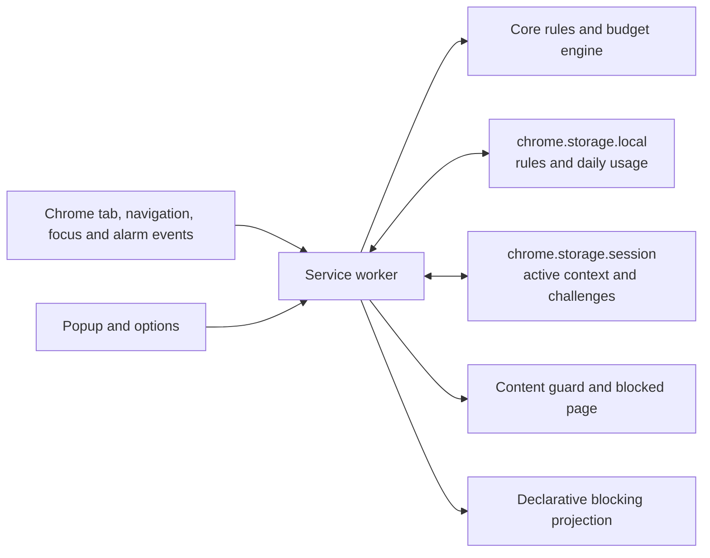

# Architecture — Visit Budget

## System overview

Visit Budget is a local-only Manifest V3 Chrome extension. The service worker
coordinates browser events and owns persisted decisions; pure core modules make
rule, usage, and daily-reset decisions; small UI surfaces render those decisions
without owning enforcement.

## Modules & boundaries

- `src/core/` — Pure rule matching, budget transitions, schema migration, and
  local-day reset. It does not call Chrome APIs or manipulate the DOM.
- `src/background/` — Serialises Chrome events, writes state, reconciles
  enforcement, and sends typed messages. It does not duplicate core decisions.
- `src/platform/` — Thin adapters around storage, permissions, alarms,
  declarative rules, and tab observation. It does not contain product policy.
- `src/shared/` — Typed extension messages shared between browser contexts.
- `src/ui/` and `public/` — Popup, options, and blocked-page controls. They
  request a result from the worker; they do not enforce a rule themselves.
- `src/content/` — Idempotent in-page guard and visit/override notifications.
  It preserves page DOM and unsaved work beneath an overlay.

## Data model

`SiteRule` defines a hostname/path scope and one mode: `visit-limit`,
`time-limit`, or `permanent-block`. Visit rules own an integer daily visit
limit and optional tab-return counting. Time rules own a daily active-time
limit; their time counts only for the selected matching tab in focused Chrome.

`DailyUsage` is local-day-scoped. It stores either visits used or active time
used, plus an override expiry. `SessionState` owns the start time of any running
active-time segment, so it survives service-worker suspension but is cleared on
a full browser restart. On an event, the worker closes any running segment
before it changes the active context. A single scheduled alarm checks local
midnight, active-time exhaustion, and override expiry even if the service
worker was suspended.

Mode changes from visit to time or back are queued for the next local midnight
so no one can reset an exhausted budget by changing units. Existing rules
migrate to visit rules with tab-return counting disabled.

## Data flow

1. A tab activation, focused-window change, committed navigation, SPA history
   update, alarm, startup, or permission change enters the service worker.
2. The worker serialises the event, settles any running active-time segment,
   finds the effective rule, then asks the core engine for the new status.
3. The worker stores the state, sets the next maintenance alarm, reconciles
   future-navigation blocking, updates the badge, and tells the active guard
   what to render.
4. The guard or blocked page can request an override challenge; the worker
   validates the budget, pause, duration, and code before it records only an
   expiry timestamp.

## External dependencies

The extension uses Chrome APIs only: storage, alarms, active-tab access,
scripting, web navigation, optional host permissions, and declarative network
rules. There is no server, account, telemetry, remote code, or third-party
analytics. If a host permission is missing, enforcement for that host is not
assumed; the UI explains and requests it only after the person adds the rule.

## Cross-cutting

- State writes are serialised in the service worker to avoid concurrent event
  double-counting.
- `chrome.storage.local` is the source of truth; declarative network rules are
  a derived projection.
- Invalid or missing override challenges fail closed. Permanent blocks never
  offer an override.
- Errors are reported only to the extension console. No browsing data or page
  content leaves the device.

## Decisions

- [001. Measure active time from focused-tab visibility](docs/adr/001-focused-tab-active-time.md)
